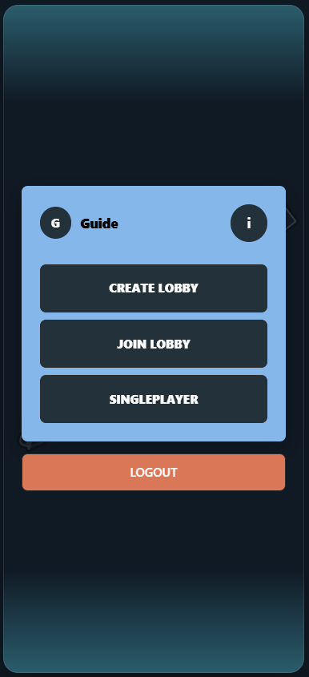
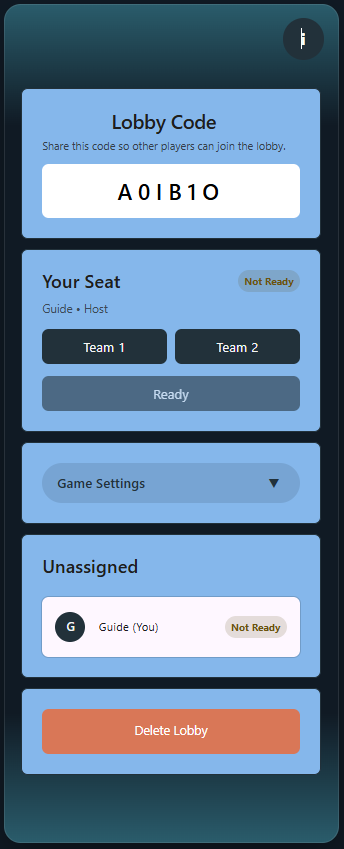
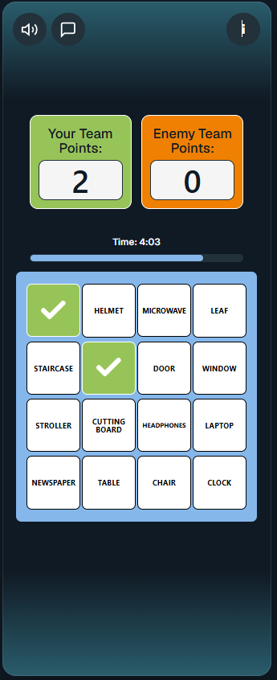
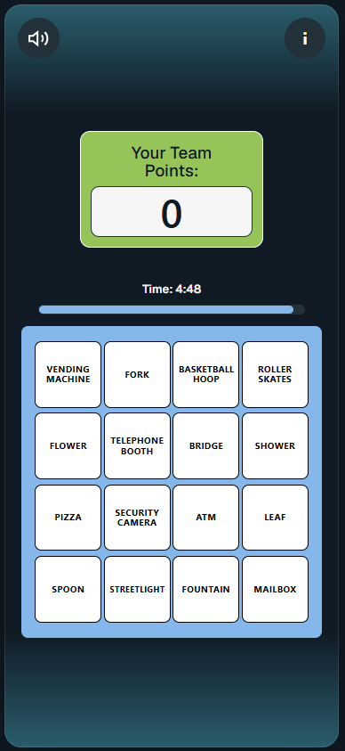
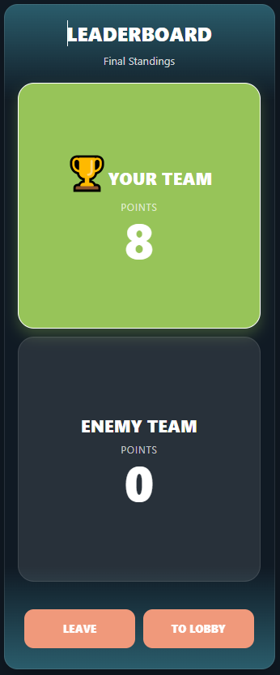

# VisionQuest — Client

> A real-time, camera-based multiplayer bingo game built for mobile browsers.

---

## Table of Contents

1. [Introduction](#introduction)
2. [Technologies](#technologies)
3. [High-Level Components](#high-level-components)
4. [Launch & Deployment](#launch--deployment)
5. [Illustrations](#illustrations)
6. [Roadmap](#roadmap)
7. [Authors & Acknowledgment](#authors--acknowledgment)
8. [License](#license)

---

## Introduction

**VisionQuest** is a competitive, real-time word game where two teams race to claim tiles on a shared 4×4 bingo board — not by guessing, but by *photographing* the real-world object shown on each tile. A player selects a tile (e.g. "MAILBOX"), opens their camera, captures a photo of that object, and submits it for automatic validation. If approved, the tile is claimed for their team. Completing a full row, column, or diagonal earns bonus "bingo" points.

The game supports:
- **Multiplayer** — two teams compete in real time with live score updates, a countdown timer, and in-game chat.
- **Singleplayer** — solo practice mode with the same mechanics but no opponent.

The backend repository can be found at: [lauringlarner/Server_SOPRA](https://github.com/lauringlarner/Server_SOPRA)

---

## Technologies

| Layer | Technology |
|---|---|
| Framework | [Next.js 15](https://nextjs.org/) (React 19, App Router) |
| Language | [TypeScript](https://www.typescriptlang.org/) |
| Runtime | [Deno](https://deno.com/) / [Node.js](https://nodejs.org/) |
| Real-time | [Pusher](https://pusher.com/) |
| Styling | Global CSS |
| Animations | [canvas-confetti](https://github.com/catdad/canvas-confetti) |
| Containerization | [Docker](https://www.docker.com/) |
| Deployment | [Vercel](https://vercel.com/) |
| CI/CD | GitHub Actions |

---

## High-Level Components

The client is organized around five main screens, each implemented as a Next.js route.

### 1. Menu — [`app/menu/page.tsx`](app/menu/page.tsx)
The home screen after login. Lets users create a new lobby, join an existing one via a 6-character code, or jump straight into singleplayer practice. It also shows an animated emoji rain and a "Take Me Back" shortcut if a previous lobby session is still active.

### 2. Lobby — [`app/lobbies/[lobbyId]/page.tsx`](app/lobbies/[lobbyId]/page.tsx)
The pre-game waiting room. Displays the shareable lobby code, lets players pick Team 1 or Team 2, and allows the host to configure game settings (duration, word list). All state is kept in sync in real time via SSE so every player sees live changes. The host can start the game once all players are ready.

### 3. Game Board — [`app/lobbies/[lobbyId]/games/[gameId]/page.tsx`](app/lobbies/[lobbyId]/games/[gameId]/page.tsx)
The core gameplay screen. Renders the 4×4 word grid with live tile-claim statuses, a countdown timer, and team score cards. Tile color reflects ownership (green = your team, orange = enemy). Completing a line triggers a confetti animation and "BINGO!" banner. Multiplayer sessions include a live chat panel with pre-set quick messages.

### 4. Submission — [`app/lobbies/[lobbyId]/games/[gameId]/submission/page.tsx`](app/lobbies/[lobbyId]/games/[gameId]/submission/page.tsx)
The camera screen. Players capture a photo of the real-world object matching the selected tile word and submit it to the backend for AI-based validation. The tile enters a "Processing" state while awaiting a result, and the board updates automatically.

### 5. Leaderboard — [`app/lobbies/[lobbyId]/games/[gameId]/leaderboard/page.tsx`](app/lobbies/[lobbyId]/games/[gameId]/leaderboard/page.tsx)
The post-game summary. Shows both teams' final scores with the winner highlighted. Players can return to the lobby for a rematch or exit to the main menu.

**How they connect:**  
`Login / Register` → `Menu` → `Lobby` → `Game Board` → `Submission` (per tile) → `Leaderboard` → back to `Menu` or `Lobby`.

---

## Launch & Deployment

### Prerequisites

- [Git](https://git-scm.com/)
- macOS / Linux / WSL (Windows users: see the WSL setup section below)

### Quick Start

```bash
# 1. Clone the repository
git clone https://github.com/lauringlarner/Client_SOPRA.git
cd Client_SOPRA

# 2. Install all dependencies (uses Nix + direnv under the hood)
source setup.sh

# 3. Start the development server
deno task dev
# or: npm run dev
```

The app is then available at [http://localhost:3000](http://localhost:3000).

> **Backend required:** The client expects the backend to be running at `http://localhost:8080` (default). Clone and start [Server_SOPRA](https://github.com/lauringlarner/Server_SOPRA), then create a `.env.local` file in the project root:
> ```
> NEXT_PUBLIC_LOCAL_API_URL=http://localhost:8080   # optional — this is already the default
> NEXT_PUBLIC_PUSHER_KEY=your_pusher_key
> NEXT_PUBLIC_PUSHER_CLUSTER=your_pusher_cluster
> ```

### Available Commands

| Command | Description |
|---|---|
| `deno task dev` | Start development server with live reload |
| `deno task build` | Create an optimized production build |
| `deno task start` | Serve the production build |
| `deno task lint` | Run ESLint across the codebase |
| `deno task fmt` | Auto-format the entire codebase |

All commands also work with `npm run <command>`.

### Running Tests

There is currently no client-side test suite. Type checking can be run with:

```bash
deno task lint
```

### Releases

Releases are handled automatically: every push to `main` triggers a GitHub Actions workflow that builds a production Docker image and pushes it to Docker Hub.

### Docker Deployment

Every push to `main` automatically builds and pushes a Docker image via GitHub Actions.

**Pull and run manually:**

```bash
docker pull <dockerhub_username>/<dockerhub_repo_name>
docker run -p 3000:3000 <dockerhub_username>/<dockerhub_repo_name>
```

**Docker Hub setup (one-time, per team):**
1. Create a Docker Hub account (e.g. `SoPra_group_XX`) and a repository with the same name as the GitHub repo.
2. Add three GitHub repository secrets: `dockerhub_username`, `dockerhub_password` (PAT with read/write), and `dockerhub_repo_name`.

---

### Windows Setup

If you are on Windows, install WSL first:

1. Download [`windows.ps1`](./windows.ps1).
2. Open PowerShell **as Administrator** and run:
   ```powershell
   C:\Windows\System32\WindowsPowerShell\v1.0\powershell.exe -ExecutionPolicy Bypass -File .\windows.ps1
   ```
3. After installation, open WSL/Ubuntu, choose a username and password, then follow the Quick Start above inside the WSL terminal.

> Make sure the repository folder lives inside the WSL2 filesystem (not `/mnt/c/...`) to avoid slow disk I/O.

<details>
<summary>Troubleshooting the installation</summary>

If `source setup.sh` fails, try the manual steps:

```bash
# Install Determinate Nix
curl --proto '=https' --tlsv1.2 -ssf --progress-bar -L https://install.determinate.systems/nix -o install-nix.sh
sh install-nix.sh install --determinate --no-confirm --verbose

# Install direnv
nix profile install nixpkgs#direnv

# Hook direnv into your shell — see https://github.com/direnv/direnv/blob/master/docs/hook.md
# Then allow the repo
direnv allow
```

</details>

---

## Illustrations

### Main User Flow

The typical journey through the app:

**1. Main Menu**

After logging in, users land on the menu where they can create a new lobby, join one with a 6-character code, or start a solo practice session.



---

**2. Lobby**

The host shares the lobby code with friends. Players pick their team and signal readiness. The host can adjust game duration and word list before starting.



---

**3. Game Board — Multiplayer**

Both teams see the same 4×4 grid. Claimed tiles are marked with a checkmark: green for your team, orange for the enemy. A progress bar tracks remaining time. The chat icon opens a quick-message panel.



---

**4. Game Board — Singleplayer**

The same grid in solo mode — a single score card and no opponent tiles.



---

**5. Leaderboard**

Final scores are shown after the timer runs out or all tiles are claimed. The winning team card is highlighted in green.



---

> **Note:** To add screenshots, create a `docs/screenshots/` folder in the repository and upload the images with the filenames above.

---

## Roadmap

Features that new contributors could add to extend the game:

1. **Custom word lists** — Let the lobby host upload or type their own word list instead of choosing from preset categories, enabling themed games (e.g. office scavenger hunt, city walk).

2. **Spectator mode** — Allow users to watch an ongoing game in read-only mode without joining a team, with live tile updates and the chat feed.

3. **User profiles & statistics** — Expand the existing profile screen to show win rate, total games played, favourite word categories, and a personal best score.

---

## Authors & Acknowledgment

| Name | GitHub |
|---|---|
| Arda Aydın | [@ardaaydin](https://github.com/ardaaydin) |
| Laurin Glarner | [@laurinlarner](https://github.com/lauringlarner) |
| Naren Wallimann | [@Wallimann20-914-099](https://github.com/Wallimann20-914-099) |
| Melchior Kneubuehler | [@mel-kne](https://github.com/mel-kne)|
| Alessio Martinoli | [@AleMarti0](https://github.com/AleMarti0)|

This project was developed as part of the **Software Engineering Lab (SoPra FS26)** course at the University of Zurich.  
Template and course infrastructure provided by [HASEL UZH](https://github.com/HASEL-UZH).

---

## License

To be determined.
